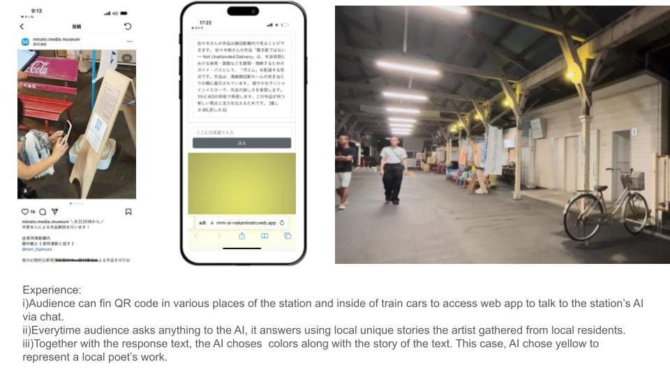
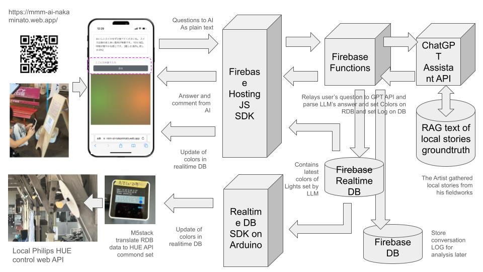
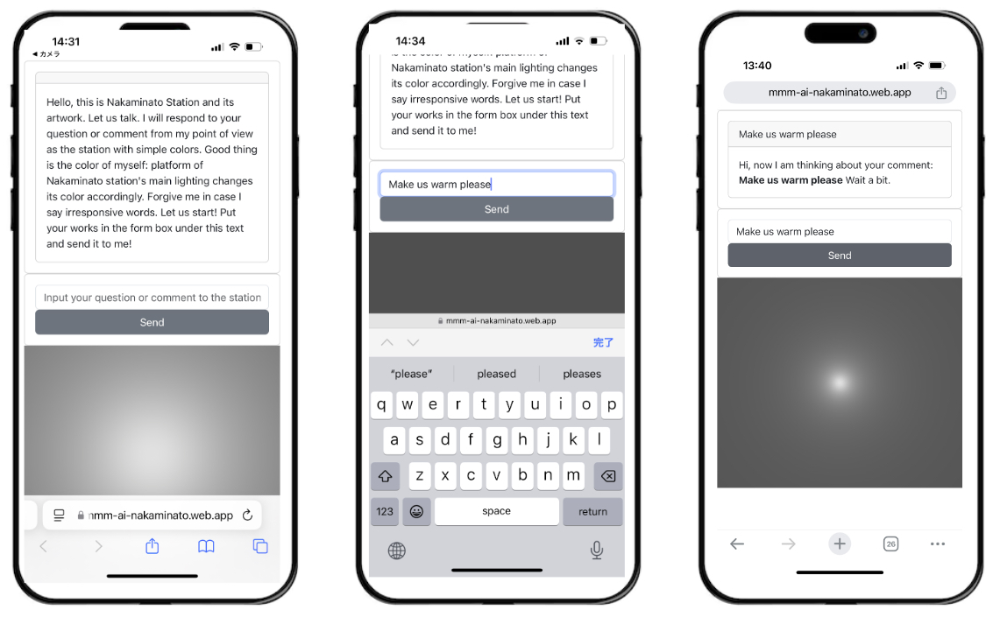
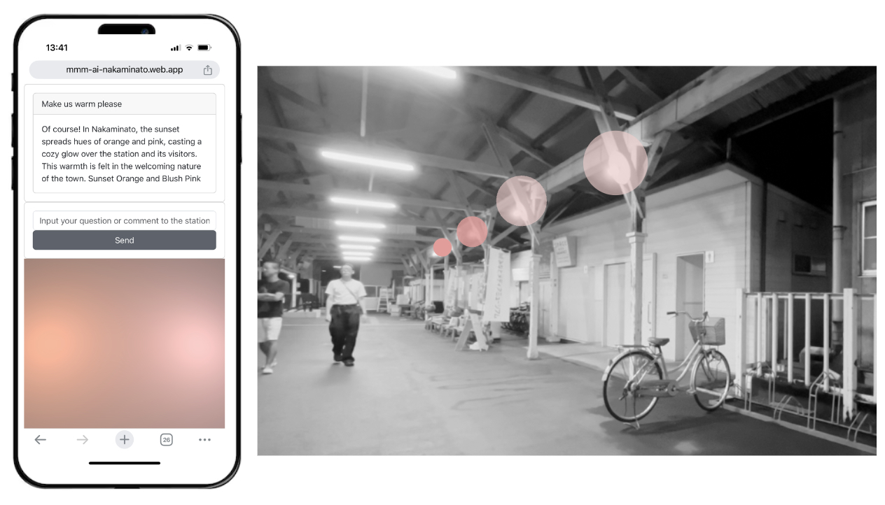

# conversation-nakaminato-v1
Partial copy of the repo 'breathing-mmm' for code review of the artwork 'Have a conversation with the place: Nakamnato station '
  * https://www.norifujimura.com/conversation-with-nakaminato-station/ 
Firebase(Realtime DB/DB/Functions/Hosting), ChatGPT API(Chat complete/Assistant/RAG), Javascript, Python(for chatGPT prototyping), Arduino, 

* Front end codes in JS
  * https://github.com/norifujimura/conversation-nakaminato-v1/blob/main/web-front-end/index-e.html
* Firebase function codes in JS
  * https://github.com/norifujimura/conversation-nakaminato-v1/blob/main/web-functions/index.js
* M5stack/Arduino(C++) code to handle Philips HUE web api
  * https://github.com/norifujimura/conversation-nakaminato-v1/tree/main/m5stack/firebase_read_stream_library_hue_lights_timer_monitorsound

## Experience

## Architecture

## Working Demo

* [mmm-ai-nakaminato.web.app/index-e.html](mmm-ai-nakaminato.web.app/index-e.html)
* When you scan the QR code by mobile/tablet, following webapp appears and you can try the artwork. 

* i~ii)When the screen appears, read through the text and put whatever you want to ask to the station in the text form in the middle of the screen
* iii) Then AI takes a few seconds to think...

* iv-v)AI’s reaponse appears in both text form as well as colors. Do not forget now the colors of lights in Nakaminato station of Japan countryside is actually changing to this color.

## What audience has asked? A bit of context of the work
* This work is a commision work. Request from the client: NPO of Minato Media Museum and a railway company was to attract new users of the train station beyond existing passensers. Therefore the AI has designed to answer basic facts of the station and also episodes around the station includes famous cat of the station, etc.
* Users has been encouraged to ask questions such as ' How is the cat of the station today?' "What to eat there?' and also command to change the color of lighting of the station such as "Show the color of cherry blossoms" (In this case AI responds with pink colors), "Set lights best for sunset", etc.
* We also find questions about detailed facts of Train cars, some emotional comments about the city and station.
  
